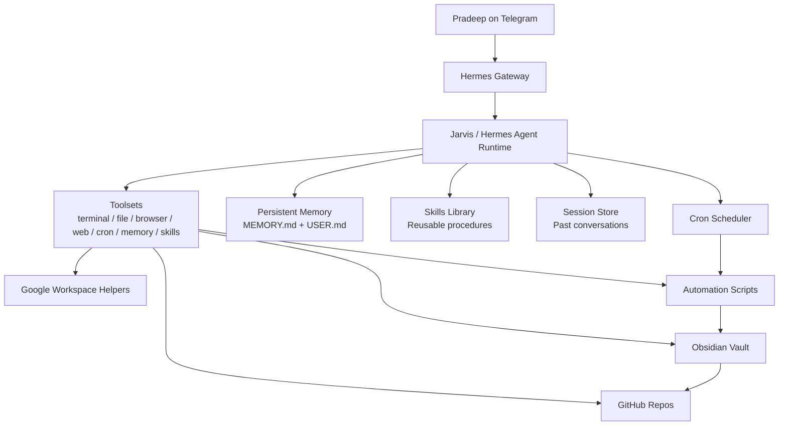

# Jarvis: My Hermes + Obsidian + Automation Operating System

This repository documents a real, working personal AI operating system built on **Hermes Agent** and shaped into a practical chief-of-staff + builder workflow named **Jarvis**.

This is not a chatbot prompt dump.
It is a persistent agent setup with:

- a live **Telegram-based execution interface**
- a git-backed **Obsidian knowledge vault**
- durable **cross-session memory**
- a growing **skills library**
- scheduled **cron automations**
- portfolio/research workflows
- Google Workspace delivery hooks
- safety rails for approvals, credentials, and destructive actions

The result is an agent that does more than answer questions. It can remember context, manage recurring work, maintain a knowledge base, operate through tools, and keep improving through reusable procedures.

## Start here

If you want the recruiter-friendly version first:

- **Case study:** [`docs/portfolio-case-study.md`](docs/portfolio-case-study.md)
- **Technical system profile:** [`docs/live-system-profile.md`](docs/live-system-profile.md)

If you want the full architecture story, keep reading below.

## Why this project matters

Most AI demos stop at "look, it can chat."

This system goes further:

- **Persistent context** instead of stateless conversations
- **Operational memory** instead of one-off prompts
- **Tool-using execution** instead of text-only output
- **Knowledge capture** in Obsidian instead of scattered notes
- **Scheduled workflows** instead of manual follow-up
- **Self-improving procedures** via skills instead of relearning the same tasks every week

In portfolio terms, this project showcases:

- product thinking
- systems design
- agent orchestration
- automation design
- knowledge management
- operational rigor
- honest handling of real-world edge cases

## What Jarvis actually is

Jarvis is my operating layer on top of Hermes Agent.

Conceptually:

- **Hermes Agent** is the underlying agent framework
- **Jarvis** is the personalized runtime behavior, memory profile, voice, workflow style, and automation stack
- **Obsidian** is the long-term knowledge surface
- **GitHub** is the backup/publication layer
- **Cron + scripts** are the recurring execution engine

## System architecture

## Live setup snapshot

This write-up is grounded in the live system state audited from the running container on **2026-05-02**.

### Runtime

- Hermes version: **v0.12.0 (2026.4.30)**
- Install path: `/opt/hermes`
- Launcher: `/hermes.sh`
- Primary model provider: `openai-codex`
- Primary model: `gpt-5.4`
- Fallback providers configured:
  - `openrouter / deepseek/deepseek-v4-pro`
  - `openrouter / anthropic/claude-sonnet-latest`
- Terminal backend: `local`
- Checkpoints: enabled
- Context compression: enabled
- Tool progress/interim messaging: enabled

### Data root

The live Hermes data root for this deployment is mounted at:

- `/opt/data`

Key subdirectories discovered in the live environment:

- `/opt/data/workspace`
- `/opt/data/skills`
- `/opt/data/sessions`
- `/opt/data/memories`
- `/opt/data/scripts`
- `/opt/data/cron`
- `/opt/data/logs`
- `/opt/data/backups`
- `/opt/data/checkpoints`
- `/opt/data/profiles`

### Telegram gateway

Jarvis is operated primarily through **Telegram DM**.

The live process list showed the gateway running as:

- `/opt/hermes/venv/bin/python3 /root/.local/bin/hermes gateway run`

The launcher script is designed to:

- start from a safe working directory (`/opt/data`, fallback `/root`)
- auto-start the Telegram gateway when `TELEGRAM_BOT_TOKEN` is present
- clear stale gateway lock files before restart attempts
- hand control back to the Hermes CLI after setup

This is the kind of operational detail that matters in real deployments: the system is not just configured once; it is designed to survive stale state, deleted working directories, and long-lived runtime drift.

## Obsidian vault: the knowledge layer

The knowledge backbone of Jarvis is a git-backed Obsidian vault located at:

- `/opt/data/workspace/obsidian-vault`

Live audit results:

- Markdown files in vault: **590**
- Git repo: **yes**
- Branch: `main`
- Remote: `https://github.com/realgradientdescent/hermes-vault.git`

This vault is not a passive notebook. It functions as:

- working memory externalization
- report archive
- idea backlog
- research surface
- system logbook
- automation output destination

### Why this matters

Most people use AI in a disposable way: ask, receive, forget.

This setup turns AI work into a compounding asset:

- outputs become notes
- notes become searchable history
- history becomes reusable context
- context improves future decisions

That is a much stronger operating model than living inside fragmented chat threads.

## Memory management: how Jarvis remembers

Hermes separates memory into two durable layers:

### 1. User profile memory

Stored in:

- `/opt/data/memories/USER.md`

Purpose:

- who the user is
- communication style
- preferences
- workflow expectations
- recurring constraints

Live size during audit:

- **1,383 chars** used
- configured limit: **1,375 chars** in config (the live file is effectively right at the cap)

### 2. System/environment memory

Stored in:

- `/opt/data/memories/MEMORY.md`

Purpose:

- stable environment facts
- repo paths
- runtime quirks
- deployment notes
- tool behavior
- lessons learned from prior work

Live size during audit:

- **2,191 chars** used
- configured limit: **2,200 chars**

### Why this design is smart

This split is subtle but important.

Jarvis does **not** treat all memory equally.

It separates:

- **user truth** from
- **system truth**

That prevents a common failure mode in agent systems: mixing personal preferences, temporary task state, and machine facts into one giant blob until the memory becomes noisy or dangerous.

Instead, the setup favors:

- compact durable facts
- high signal over long history
- reusable operational knowledge
- explicit boundaries around what should and should not persist

## Skills: Jarvis' procedural memory

If memory stores facts, **skills** store procedures.

Live audit results:

- top-level skill categories: **28**
- `SKILL.md` files discovered: **125**

These skills span areas like:

- autonomous agents
- GitHub workflows
- research
- portfolio building
- Google Workspace
- note-taking
- media workflows
- MCP integrations
- devops
- software development

### Why skills matter

This is one of the most interesting parts of Hermes.

A normal assistant answers from general knowledge.
A better assistant remembers user facts.
A much stronger assistant also remembers **how** to do recurring tasks well.

That means Jarvis can build up a procedural library for things like:

- publishing to GitHub
- debugging Hermes itself
- managing cron jobs
- writing portfolio case studies
- operating Google Workspace flows
- running browser-based QA

This is a genuine compounding mechanism: the agent gets more useful not just by better prompting, but by accumulating reusable playbooks.

## Sessions: long-term conversational recall

The live system contains:

- **180** stored sessions

This matters because memory alone is intentionally small.
The broader recall layer lives in session history, which can be searched when past work matters.

That gives Jarvis two different time horizons:

- **short durable memory** for stable truths
- **deep session recall** for project history and prior investigations

That is a much better architecture than trying to cram everything into permanent memory.

## Automation layer: cron + scripts + delivery

Jarvis is not only reactive. It also runs scheduled jobs.

Live cron storage exists at:

- `/opt/data/cron`

Audited scripts in `/opt/data/scripts` include:

- `vault_git_sync.py`
- `x_idea_radar_daily.py`
- `x_idea_radar_weekly.py`
- `generate_ai_radar_attachments.py`
- `gmail_send_attachment.py`
- `update_weekly_calendar_md_link.py`
- `create_weekly_backlog_calendar.py`
- `mobile_portfolio_qa.py`
- `qa_report_helper.py`

### Notable recurring jobs found in the live scheduler

- **AI Agent Idea Radar — Daily Morning Brief**
- **AI Agent Idea Radar — Weekly Ideas and Backlog**
- **Daily Hermes vault git sync**

These jobs show the system behaving like an actual operating assistant:

- monitor sources
- synthesize signals
- write reports
- update backlog artifacts
- sync knowledge to GitHub
- deliver outputs through other channels

That is real workflow automation, not just prompt engineering.

## GitHub synchronization and backup strategy

The Obsidian vault is protected by a dedicated Git workflow.

A custom sync script (`/opt/data/scripts/vault_git_sync.py`) does the following:

- checks whether the vault repo exists
- discovers the active branch and remote
- loads `GITHUB_TOKEN` from `/opt/data/.env` if needed
- injects a non-interactive HTTPS auth header for GitHub
- preflights remote access with `git ls-remote`
- fetches, stages, commits, and pushes only when needed
- reports concise status back into the Hermes workflow

This is worth calling out because it demonstrates good operational taste:

- avoids embedding secrets in remote URLs
- avoids brittle manual sync habits
- supports unattended operation
- keeps the vault safely versioned

## Google Workspace integration

The current environment also contains a dedicated OAuth virtual environment:

- `/opt/data/google-oauth-venv`

This is used alongside helper scripts for:

- sending email attachments
- writing Google Docs
- updating calendar-linked reports

That means Jarvis is not boxed into a terminal. It can bridge from AI analysis into actual delivery surfaces that people use.

## gbrain / qmd status: honest reality vs architecture intent

This repository name includes **gbrain**, and there is real evidence that the broader system design includes gbrain/QMD-based knowledge workflows.

Evidence found:

- migration bootstrap script: `/opt/data/migration_bootstrap/bootstrap_gbrain_obsidian_qmd.sh`
- bootstrap defaults expect:
  - `GBRAIN_DIR="$HOME/gbrain"`
  - QMD indexing over the vault

However, in the **current live container audit**:

- `/root/gbrain` was **not present**
- `gbrain` command was **not found**
- `qmd` command was **not found**

That distinction matters.

So the correct framing is:

- the system has a documented **migration/integration path** for gbrain + qmd
- but the current container snapshot is **not actively running** that layer

This is actually a positive portfolio signal, not a weakness. It shows honest systems thinking: document the architecture, capture the migration tooling, and report the live state precisely instead of pretending every optional component is active.

## Safety model

The Hermes config also shows a deliberate safety posture:

- approvals mode: `manual`
- cron mode approvals: `deny`
- secret redaction: enabled
- Tirith security layer: enabled
- destructive commands are explicitly allowlisted for review, not blindly run

That matters because the more tool power an agent gets, the more important operational controls become.

## Why this is portfolio-worthy

This project demonstrates a type of AI work I think matters more than thin wrappers around LLM APIs.

It shows how to build an agent system that is:

- personalized
- stateful
- operational
- inspectable
- automatable
- grounded in files, repos, and real workflows

It also shows product judgment:

- using Obsidian as the long-term knowledge surface
- using GitHub for durability and portability
- separating facts from procedures via memory vs skills
- using cron for repeated value creation
- using plain-language reporting for human trust
- preserving safety boundaries while still enabling execution

## Repo contents

- `README.md` — high-level overview and architecture
- `docs/portfolio-case-study.md` — recruiter-facing case study
- `docs/live-system-profile.md` — deeper technical profile of the audited live setup

## Final takeaway

Jarvis is not "an AI assistant" in the generic sense.

It is a **personal AI operating system**:

- chat interface
- memory layer
- skill layer
- tool layer
- knowledge vault
- automation layer
- delivery layer
- backup/versioning layer

That stack is what makes the system useful.

And that, more than any single prompt, is what makes it worth showcasing.
